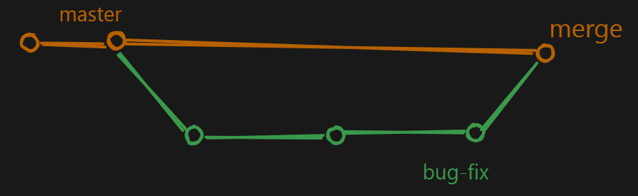
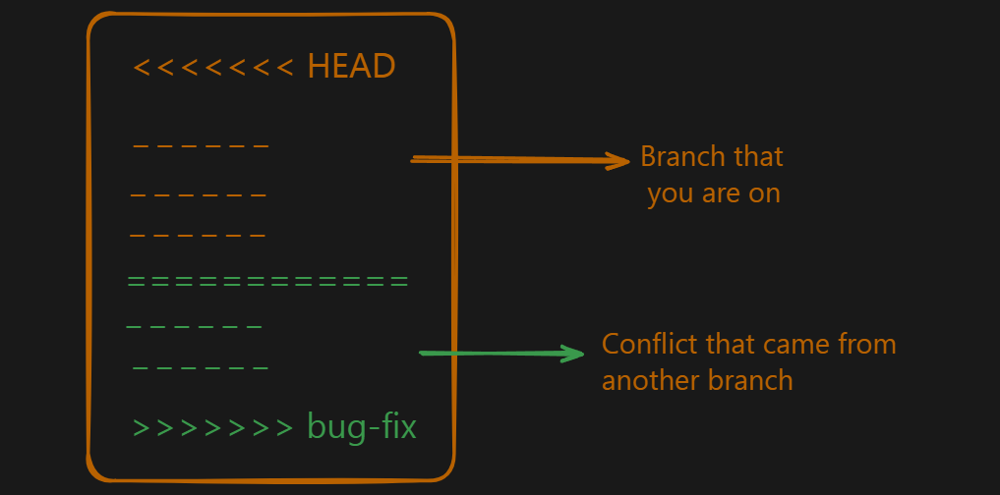

# Git & GitHub Notes
**Git** : Git is a version control system that is used to track changes to your files.

**GitHub** :  Github is a web-based hosting service for Git repositories. Github is an online platform that allows you to store and share your code with others.
<hr>

***To install Git*** : [<ins>**Click Here**</ins>](https://git-scm.com/downloads)

**To check your git version**, you can run the following command:

```bash
git --version 
```
**To enter a folder :**
```bash
cd folderName
```

**Exit from a folder :**
```bash
cd ..
```
**Create directory :**
```bash
mkdir fileOne fileTwo fileThree
```
**Prints the full path of the current working directory to the standard output :**
```bash
pwd
```
**Show the list of files :**
```bash
ls
```
**Show the list of files and hidden ones :**
```bash
ls -la
```

<hr>

**Setup :**
Configuring user information used across all local repositories

```bash
git config --global user.name “[firstname lastname]”
```
<sup>set a name that is identifiable for credit when review version history</sup>

```bash
git config --global user.email “[valid-email]”	
```
<sup>set an email address that will be associated with each history marker </sup>

<hr>

**SETUP & INIT :**
Configuring user information, initializing and cloning repositories
```bash
git init
```
<sup>initialize an existing directory as a Git repository</sup>
```bash
git clone [url]
```
<sup>retrieve an entire repository from a hosted location via URL</sup>

**Now you can check your config settings:**
```bash
git config --list
````
<hr>

**To see the current state of your repository :**
```bash
git status
```
**Creating a repository is a process of creating a new folder on your system and initializing it as a git repository :**
```bash
git init
git status
```
<sup>**git status** command will show you the current state of your repository. **git init** command will create a new folder on your system and initialize it as a git repository. This adds a hidden **.git** folder to your project.</sup>


>When you want to track a new folder, you first use **init** command to create a new repository. Then you can use **add** command to add the folder to the repository. After that you can use commit command to save the changes. Finally you can use push command to push the changes to github. Of course there is more to it but this is the basic flow.

<hr>

**Create a file :**
```bash
touch File.txt
```
<sup>Then if you do **git status** it's show the branch(one branch **main/master**) and show “No commits yet” and untracked files.</sup>


**Stage is a way to tell git to track a particular file or folder. You can use the following command to stage a file:**

```bash
git add <file> 
git add . 
#for add all files in once
git status
```
><sup>Here we are initializing the repository and adding a file to the repository. Then we can see that the file is now being tracked by git. Currently our files are in staging area, this means that we have not yet committed the changes but are ready to be committed.</sup>

**Commit :**

```bash
git commit -m "commit message"
git status
```

**Logs :**

```bash
git log
git log --oneline
```
><sup>This command will show you the history of your repository. It will show you all the commits that were made to the repository. You can use the **--oneline** flag to show only the commit message. This will make the output more compact and easier to read.</sup>

**gitignore :**
Gitignore is a file that tells git which files and folders to ignore. It is a way to prevent git from tracking certain files or folders. You can create a gitignore file (touch .gitignore) and add list of files and folders to ignore by using the following command:

Example:

```
node_modules
.env
.vscode
```
>Now, when you run the **git status** command, it will not show the **node_modules, .env** and **.vscode** folders as being tracked by git.
<hr>


>If you can't see the .git folder which is hidden in vscode , go to settings then go to Files: Exclude and cross the **/ .git**

## Branched in git

<sup>Some developers can work on Header, some can work on Footer, some can work on Content, and some can work on Layout. This is a good example of how branches can be used in git.</sup>

**Creating a new branch :**

To create a new branch, you can use the following command:

```bash
git branch
git branch bug-fix
git switch bug-fix
git log
git switch master
git switch -c dark-mode
git checkout orange-mode
```

- `git branch` - This command lists all the branches in the current repository.
- `git branch bug-fix` - This command creates a new branch called `bug-fix`.
- `git switch bug-fix` - This command switches to the `bug-fix` branch.
- `git log` - This command shows the commit history for the current branch.
- `git switch master` - This command switches to the `master` branch.
- `git switch -c dark-mode` - This command creates a new branch called `dark-mode`. the `c` flag is used to create a new branch.
- `git checkout orange-mode` - This command switches to the `orange-mode` branch.

> Commit before switching to a branch.
>
> Go to **.git** folder and checkout to the HEAD file.

<hr>

**Merging branches**
- Fast-forward merge


>This one is easy as branch that you are trying to merge is usually ahead and there are no conflicts.

>When you are done working on a branch, you can merge it back into the main branch. This is done using the following command:

```bash
git checkout main
git merge bug-fix
```
<sup>This is a fast-forward merge. It means that the commits in the bug-fix branch are directly merged into the main branch. This can be useful when you want to merge a branch that has already been pushed to the remote repository.</sup>

**Some points to note:**

- `git checkout main` - This command switches to the `main` branch.
- `git merge bug-fix` - This command merges the `bug-fix` branch into the `main` branch.

<hr>

- Not fast-forward merge


>In this type of merge, the master branch also worked and have some commits that are not in the `bug-fix` branch. This is a not fast-forward merge.

>When you are done working on a branch, you can merge it back into the main branch. This is done using the following command:
```bash
git checkout main
git merge bug-fix
```
><sup>The difference is resolving the conflicts. In a fast-forward merge, there are no conflicts. But in a not fast-forward merge, there are conflicts, and there are no shortcuts to resolve them. You have to manually resolve the conflicts. Decide, what to keep and what to discard. VSCode has a built-in merge tool that can help you resolve the conflicts.</sup>



**Rename a branch**

```bash
git branch -m <old-branch-name> <new-branch-name>
```

**Delete a branch**

```bash
git branch -d <branch-name>
```
<hr>

**INSPECT & COMPARE**

Examining logs, diffs and object information
```bash
git log
#show the commit history for the currently active branch
```
```bash
git log branchB..branchA
#show the commits on branchA that are not on branchB
```
```bash
git log --follow [file]
#show the commits that changed file, even across renames
```
```bash
git diff branchB...branchA
#show the diff of what is in branchA that is not in branchB
```
```bash
git show [SHA]
#show any object in Git in human-readable format
```
<hr>

**REWRITE HISTORY**

Rewriting branches, updating commits and clearing history
```bash
git rebase [branch]
#apply any commits of current branch ahead of specified one
```
```bash
git reset --hard [commit]
#clear staging area, rewrite working tree from specified commit
```
<hr>

**Git Stash**

><sup>Stash is a way to save your changes in a temporary location. It is useful when you want to make changes to a file but don’t want to commit them yet. You can then come back to the file later and apply the changes.
Conflicting changes will not allow you to switch branches without committing the changes. Another alternative is to use the git stash command to save your changes in a temporary location.</sup>


git stash

>This command saves your changes in a temporary location. It is like a stack of changes that you can access later.

**Naming the stash**
You can also name the stash by using the following command:

```bash
git stash save "work in progress on X feature"
```
**View the stash list**
You can view the list of stashes by using the following command:

```bash
git stash list
```
**Apply the stash**
You can apply the stash by using the following command:

```bash
git stash apply
```
**Apply the specific stash**
You can apply the specific stash by using the following command:

```bash
git stash apply stash@{0}
```
Here **stash@{0}** is the name of the stash. You can use the **git stash list** command to get the name of the stash.

**Applying and dropping the stash**
You can apply and drop the stash by using the following command:

```bash
git stash pop
```
This command applies the stash and drops it from the stash list.

**Drop the stash**
You can drop the stash by using the following command:

```bash
git stash drop
```
**Applying stash to a specific branch**
You can apply the stash to a specific branch by using the following command:

```bash
git stash apply stash@{0} <branch-name>
```
**Clearing the stash**
You can clear the stash by using the following command:

```bash
git stash clear
```
<hr>